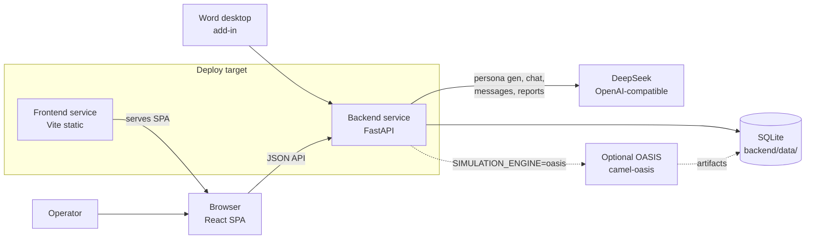

# Opinionssimulator architecture

## Purpose

Opinionssimulator is an internal tool for testing political messaging against AI agent populations grounded in local civic context. Swedish UI by default.

This document describes the **current phase 1** system: FastAPI + React SPA + SQLite, optional OASIS multi-agent simulation, and hybrid HTML reports. It is verified against the codebase — not a future-state sketch.

## High-level view

## Stack (phase 1)

| Layer | Choice |
| ----- | ------ |
| Frontend | Vite · React · TypeScript · Tailwind · shadcn · React Router |
| Backend | Python 3.12+ · FastAPI · SQLAlchemy · Alembic · pydantic-settings |
| Database | SQLite via `aiosqlite` (`backend/data/`) |
| API logs | Rotating file `backend/data/logs/app.log` (uvicorn stdout unchanged) |
| LLM | DeepSeek (`DEEPSEEK_API_KEY` required at startup) |
| Embeddings (SSR) | OpenAI `text-embedding-3-large` (`OPENAI_API_KEY` required) |
| Simulation | `SIMULATION_ENGINE=none` (default) or `oasis` (optional extra) |
| Auth | Not wired — Supabase Auth planned later |
| Hosting | Railway (frontend + backend services) |

Phase 1 deliberately uses SQLite before Supabase. Models/migrations stay portable so `DATABASE_URL` can point at Postgres later.

## System boundaries

- **Browser:** thin SPA. Renders admin UI; calls FastAPI over JSON. Never holds service-role credentials or runs simulation logic.
- **Backend:** authoritative for CRUD, LLM calls, background jobs, OASIS orchestration, and report generation.
- **SQLite:** durable product state (personas, populations, runs, messages, catalog, jobs, reports, persona chat history).
- **DeepSeek:** persona generation, anecdotes, library chat, run-scoped interviews, message variants/URL summarize, report narrative.
- **OASIS (optional):** multi-agent Twitter/Reddit-style simulation via `camel-oasis`. Heavy optional install (`uv sync --extra oasis`).

## Domain model

| Entity | Role |
| ------ | ---- |
| **Persona** | Biography, tone, local context, optional anecdote (`anekdot`) |
| **Population** | Named set of persona members (+ recipe/fingerprint for generation) |
| **Message** | Budskapsbibliotek entry; can be linked into tick injections |
| **CatalogList** | Editable grunddata lists (orter, occupations, …) with district LLM context |
| **Run** | Simulation körning: timeline (`main_ticks`), optional branch, OASIS options, status, results. Table `runs`. |
| **ExecutionRun** | Generic work/investigation container (product name: Run). Table `execution_runs`. Not a legal case and not a simulation körning. |
| **ExecutionAttempt** | One concrete execution of an ExecutionRun (product: Attempt), with immutable snapshots once started. Table `execution_attempts`. |
| **EvidenceSet** | Building, frozen, or failed knowledge snapshot reused by Attempts in the same ExecutionRun. |
| **PersonaMessage** | Chat turns — library chat (`run_id` null) or run-scoped interview |
| **Job** | Background work: `population_generate`, `run_simulate`, `report_generate` |
| **Report** | Hybrid HTML report over one or more run attempts |

Simulation `Run` and execution `ExecutionRun` are different models. Do not reuse `runs` for panel / Word / DD / procurement work.

### Execution domain (Run → Attempt → EvidenceSet)

Platform-level lifecycle in `backend/app/services/execution/`. An **ExecutionRun** is a long-lived investigation (mandatory `customer_id`, plus `module`, `title`, `context`). An **ExecutionAttempt** is one execution: `configuration_snapshot`, `input_snapshot`, and `research_plan_snapshot` are historical JSON, not pointers to live config. An **EvidenceSet** snapshots `ResearchEvidence` into `evidence_set_items` (excerpt, locator, provenance, original evidence id, ordinal, content hash) and becomes immutable when frozen. `clone_attempt` (and `POST /execution/attempts/{id}/clone`) creates a new `ready` Attempt with `parent_attempt_id`, the same frozen `evidence_set_id`, copied input/research snapshots, and no result. Optional `configuration_snapshot` is a full replacement — no merge. Source Attempt and EvidenceSet are never mutated. Clone is not idempotent.

Statuses on Attempt: `created`, `researching`, `ready`, `running`, `completed`, `failed`. `execute_attempt_research` (`app/services/research/execution.py`) claims `created → researching`, runs the shared `ResearchRouter`, persists every `found` / `not_found` / `error` item, freezes the EvidenceSet, and marks the Attempt `ready`. Tenant scope always comes from the Run. Source-level errors do not fail the Attempt; orchestration failure marks EvidenceSet `failed` and Attempt `failed` without requiring a freeze.

`execute_generic_panel_attempt` (`app/services/panel/attempt_execution.py`) is the first method bridge: a `ready` Attempt with a same-run frozen EvidenceSet is claimed `ready → running`, the frozen items are rendered as `[E#]` prompt evidence, existing `generic_panel` runs in `frozen_evidence` mode (no new ResearchPlan, no live expert tools), and a historical `execution_attempt_results` row snapshots the `PanelResult`. Fatal panel failure marks the Attempt `failed` and leaves the EvidenceSet frozen.

The first HTTP vertical is `/execution`: create Run/Attempt, `POST .../research` (`execute_attempt_research` + standard `ResearchRouter`), `POST .../execute` (method dispatcher, v1 `generic_panel` only), `POST .../clone` (reuse frozen EvidenceSet, optional config replacement), then read Attempt / Evidence / immutable Result. Scope comes from `ExecutionRun.customer_id`. The SPA has a read-only inspector at `/execution/runs/:runId`. No Word integration.

### Run timeline shape

- **Tick:** `day`, `silent`, `injections`, `rounds`, `measurements`, planned `interviews`
- **Silent tick:** no new injections; still runs population reaction rounds under OASIS
- **Branch:** after shared stem (`afterIndex`), variants `a` / `b` with `mode`:
  - `ab` — two message formulations (labels “Version A/B”)
  - `stimulus_control` — labels “Med stimulus” / “Kontroll (ingen injektion)”; backend does **not** strip B injections — the admin UI builds silent control ticks via `makeStimulusControlBranch`
- **Oasis options:** `platform` (`twitter` \| `reddit`), `allow_population_create_post`
- **Quality:** each OASIS variant may include `quality_warnings` from lexical convergence analysis (phrase echo / cross-agent reuse)

See [runs-interviews-and-quality.md](guides/runs-interviews-and-quality.md) for API shapes, interview scopes, and constraints.

## Public API (routers)

Registered in `backend/app/main.py`:

| Area | Prefix / routes | Purpose |
| ---- | --------------- | ------- |
| Health | `GET /health` | Liveness |
| Personas | `/personas` | CRUD, generate, duplicate, library chat (+ delete/resend) |
| Populations | `/populations` | CRUD, generate, members, duplicate |
| Runs | `/runs` | CRUD, start, duplicate, attempt delete, post-hoc interviews |
| Messages | `/messages` | Budskapsbibliotek + URL summarize + variant generation |
| Catalog | `/catalog` | Editable grunddata lists |
| Jobs | `/jobs` | Create/list/get background jobs |
| Jobs WS | `WS /ws/jobs` | Snapshot + live `job.updated` fan-out (admin UI) |
| Expertgranskning WS | `WS /ws/expertgranskning` | Word-review replay + `result.created` / `result.updated` / `finished` (`word-addin/`) |
| Word add-in | `word-addin/` | Office task pane: panel dropdown, live comments, Granska igen |
| Chat WS | `WS /ws/chat` | Streaming library / run-interview chat |
| Reports | `/reports` | Queue report, list, get, `GET /reports/{id}/html` |
| Playground | `/playground` | Admin calibration: default anchors, SSR rate/compare, prompt side-by-side, agent tools (web search / SymPy; no persistence) |
| Embeddings cache | `/embeddings/cache` | List/clear disk-backed SSR anchor embeddings |
| Configurations | `/configurations` | Prompt maps + `ssr_temperature` (report SSR softmax) + per-config catalog; one active globally |
| Execution | `/execution` | Generic Run → Attempt → research → method execute → Evidence/Result (not simulation `/runs`) |

Interactive OpenAPI: `http://localhost:8000/docs`.

## Run lifecycle

1. **Configure** at `/runs/new` (guided wizard: Grund → Tidslinje → Granska) or `?mode=quick`.
2. **Persist** via `POST /runs` / `PUT /runs/{id}` (timeline JSON + optional branch + oasis options).
3. **Start** via `POST /runs/{id}/start`:
   - Rejects if already `running`
   - Freezes message-library bodies into injections when `message_id` is set
   - Sets status `running`, enqueues `run_simulate` job, returns **202** + `job_id`
4. **Worker** (`app/services/jobs.py`):
   - `run_simulate` jobs wait on `MAX_CONCURRENT_SIMULATION_JOBS` (default 2) before leaving `pending`
   - `SIMULATION_ENGINE=none` → empty attempt, status `done`
   - `SIMULATION_ENGINE=oasis` → `simulate_run` runs A/B variants concurrently (full population + injectors, all ticks)
5. **Results** stored as `results.attempts[]` (newest first). Each attempt has `variants[]` with posts, comments, follows/mutes/reports, trace, action histogram, tick markers, measurements, quality warnings.
6. **Re-run** appends a new attempt; individual attempts can be deleted.
7. **Reports** via `POST /reports` with `{ sources: [{ run_id, attempt_id }], title? }` → `report_generate` job → artifacts under `backend/data/reports/{id}/`.

Interrupted jobs are marked failed on backend startup (after migrations exist).

## LLM and chat flows

| Flow | Where | Notes |
| ---- | ----- | ----- |
| Persona generate | `POST /personas/generate` | DeepSeek or weighted stub sampling (`PERSONA_GENERATOR`) |
| Persona anecdote | persona / population gen | Short `anekdot` (≤20 words, non-political); see runbook |
| Library chat | `WS /ws/chat` (REST `POST /personas/{id}/chat` still) | Streamed tokens; `PersonaMessage` with `run_id = null`; delete/clear/resend via REST |
| Planned tick interviews | tick `interviews[]` | OASIS `ManualAction(INTERVIEW)` after reaction rounds |
| Post-hoc run interview | `WS /ws/chat` scope `run_interview` (REST still) | Scoped by attempt/variant/`through_tick_index`; feed cutoff via `run_tick_context` |
| Message variants / URL | `/messages/*` | Budskapsverkstad helpers |
| Report | report job | Deterministic metrics/charts + SSR tone/style (embeddings); no LLM narrative |

`DEEPSEEK_API_KEY` is required even when `PERSONA_GENERATOR=stub` — there is no heuristic LLM fallback for chat/reports.

Library chat and post-hoc run interviews share the `persona_messages` table but are **separate threads** (null vs set `run_id`). Planned tick interviews are OASIS actions, not rows in that table.

## OASIS (optional)

- Install: `cd backend && uv sync --extra oasis`
- Enable: `SIMULATION_ENGINE=oasis`
- A/B (and stimulus/control) variants run concurrently under distinct artifact dirs
- Cap overlapping körningar with `MAX_CONCURRENT_SIMULATION_JOBS`
- DeepSeek credentials are mirrored into env vars CAMEL reads (`apply_oasis_env`)
- Platforms: Twitter (default) or Reddit (scenario clock for tick markers)
- Injectors always post via manual actions; population `CREATE_POST` is gated by `oasis_options`
- Swedish environment prompts + action semantics in `oasis_swedish.py` / `oasis_profiles.py`
- Lexical convergence (`quality_warnings`) flags injection phrase-echo and cross-agent reuse (default ≥40% of population agents)
- Artifacts: `backend/data/oasis/run_{id}/{variant}/` (profiles + `simulation.db`)
- Per-attempt logs: `backend/data/oasis/run_{id}/attempts/{attempt_id}/{variant}.log` (also `log_path` / `log_dir` on stored results)
- CLI helper (persists attempt): `uv run python -m app.services.oasis_run --run-id N`
- Model benchmark (wall time + output metrics; does not persist attempt): `uv run python scripts/benchmark_simulation_models.py --run-id N` — see [backend setup](guides/backend-setup.md#benchmark-deepseek-models)

## Frontend surfaces

Admin UI (Devbrains charcoal + gold): `/runs`, `/personas`, `/populations`, `/messages`, `/tools` (configurations / playground / embedding cache), `/jobs`, `/reports/:id`.

Admin pages call FastAPI via `VITE_API_BASE_URL`. The SPA gates routes behind a static login (`/login`, roles `admin` / `user`). The API client reads `authAdapter.getAccessToken()` (null for the static adapter). Supabase env placeholders remain required at boot so Auth can replace the adapter later.

## Configuration sources

| Service | Module | Rule |
| ------- | ------ | ---- |
| Backend | `backend/app/config.py` | No `os.getenv` / `load_dotenv` in app code |
| Frontend | `frontend/src/lib/env.ts` | No direct `import.meta.env` outside that module |

Fail fast on missing required config.

## Current limitations

- Static frontend login only (not backend-enforced; not multi-tenant)
- No durable external job queue (in-process background tasks)
- Reports are hybrid HTML, not PDF
- Supabase Postgres/Auth not used for product state yet

## Related docs

- [Runs: interviews, branches, quality](guides/runs-interviews-and-quality.md)
- [CI](guides/ci.md)
- [Backend setup](guides/backend-setup.md)
- [Frontend setup](guides/frontend-setup.md)
- [Supabase (later)](guides/supabase-setup.md)
- [Client brief](client-brief.md)
- Operator OKF manuals: [knowledge/manual/](../knowledge/manual/)
- Root [README](../README.md) and [AGENTS.md](../AGENTS.md)
